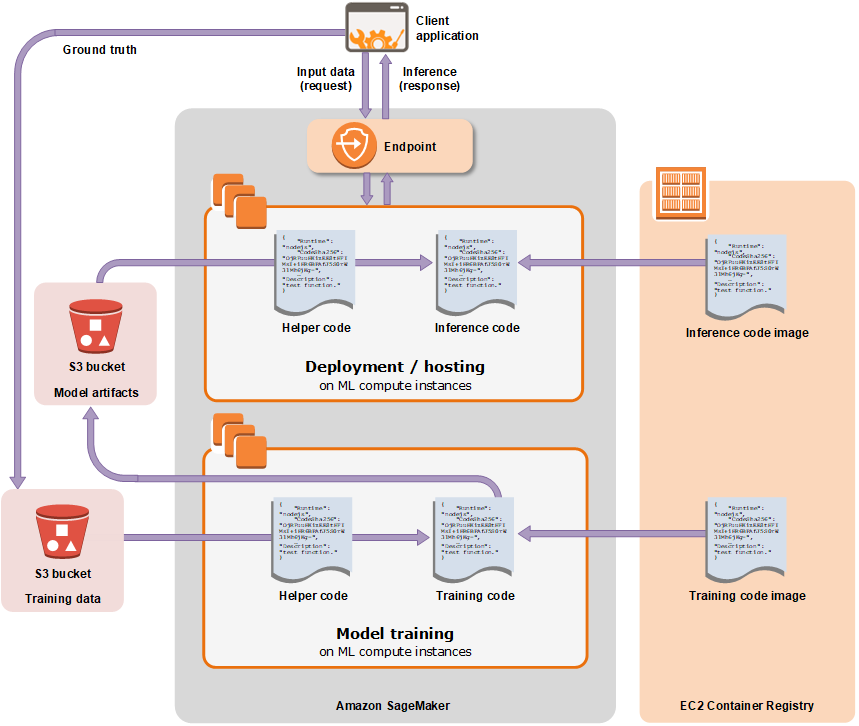
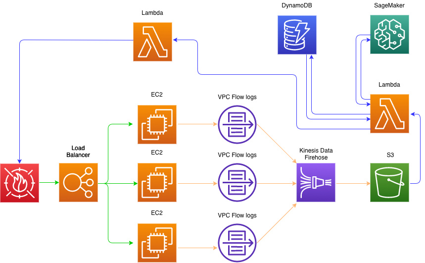

# Using Amazon VPC Flow Logs for Predictive Security Analytics

 
 
 
 
 
 
 
 

  

 
 
 
 
 
 
 
 

  

 
 
 
 
 
 
 
 

## Web Application Firewall

 
 

WAF can control how API Gateway, Amazon CloudFront or an Application Load Balancer responds to web requests.

 
 

### Protects from

 
* Cross-site scription
* Source IP
* Geo Location
* Query string
* SQL injection
* Headers and query strings

 
 
 

## VPC Flow Logs

 
 
 Feature that enables you to capture information about the IP traffic going to and from network interfaces in your VPC

  
  
  

* Stores logs in CloudWatch
* Can be enabled on:
  * Network interface
  * Subnet
  * VPC
* Each network interface has unique log stream

  
  
  

 

   
 

  
  
  

## AWS SageMaker
 
 
Amazon SageMaker is a fully managed machine learning service.
 
 
 

* Common Information
* BlazingText
* DeepAR Forecasting
* Factorization Machines
* Image Classification Algorithm
* IP Insights
* K-Means Algorithm
* K-Nearest Neighbors (k-NN) Algorithm
* Latent Dirichlet Allocation (LDA)
* Linear Learner Algorithm
* Neural Topic Model (NTM) Algorithm
* Object2Vec
* Object Detection Algorithm
* Principal Component Analysis (PCA) Algorithm
* Random Cut Forest (RCF) Algorithm
* Semantic Segmentation
* Sequence to Sequence (seq2seq)
* XGBoost Algorithm

 
 
 

  

 
 
 

### Jupyter Notebook

 
 

Notebook documents are documents that contain both computer code (e.g. python) and rich text elements (paragraph, equations, figures, links, etc…). Notebook documents are both human-readable documents containing the analysis description and the results (figures, tables, etc..) as well as executable documents which can be run to perform data analysis.
 
 
Random Cut Forest notebook:
https://github.com/awslabs/amazon-sagemaker-examples/blob/master/introduction_to_amazon_algorithms/random_cut_forest/random_cut_forest.ipynb
 
Using SageMaker Random Cut Forests to detect anomalies in VPC Flow Logs notebook:
https://github.com/Carl-Brutananadilewski/flow_logs_ml/blob/master/sm-notebook.ipynb
 

 
 
 
## Infrastructure overview
 
 
 

  

 
 
 
